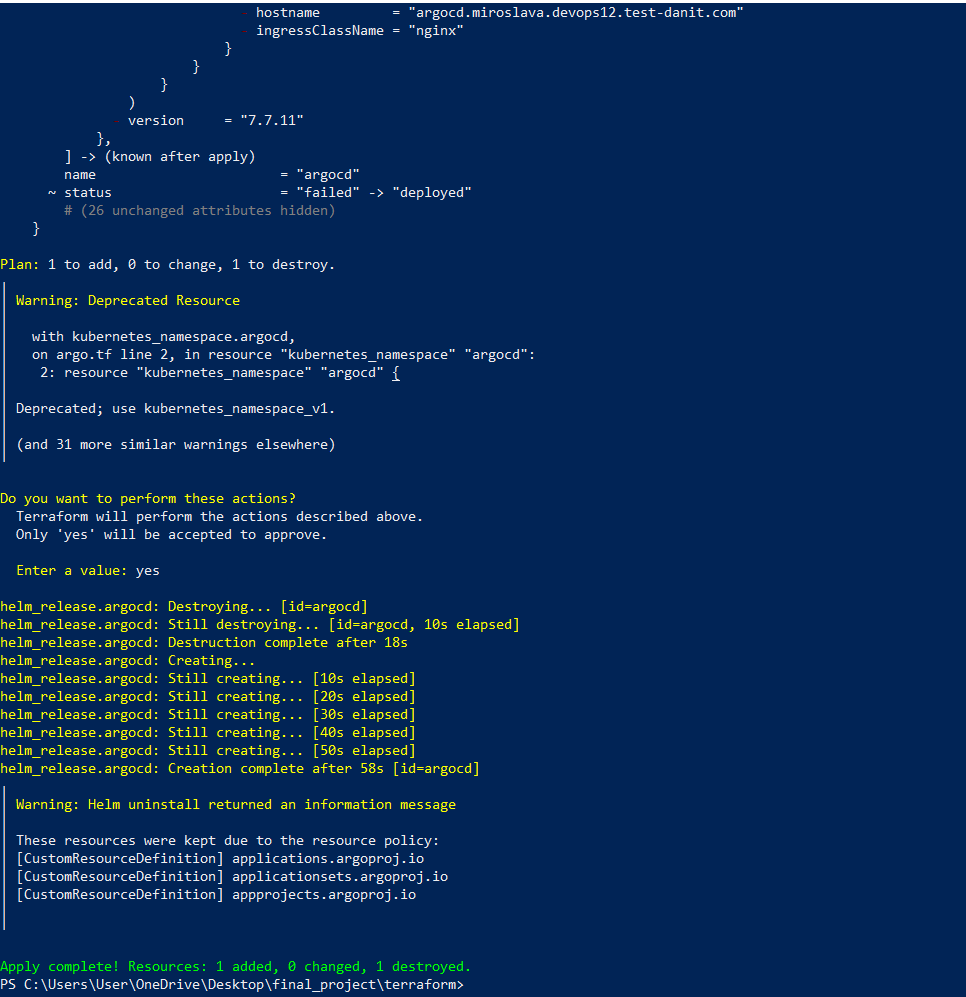
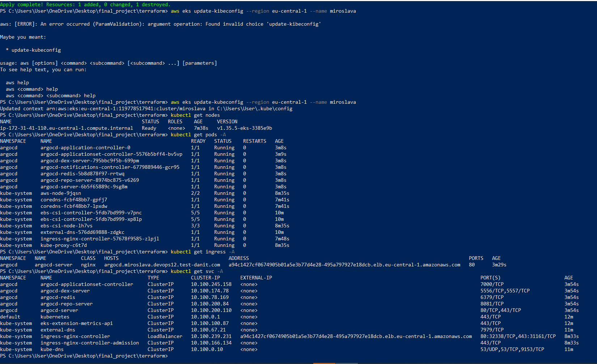
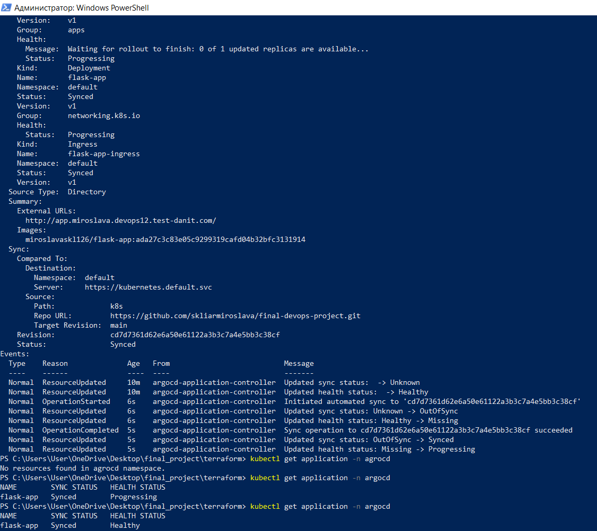
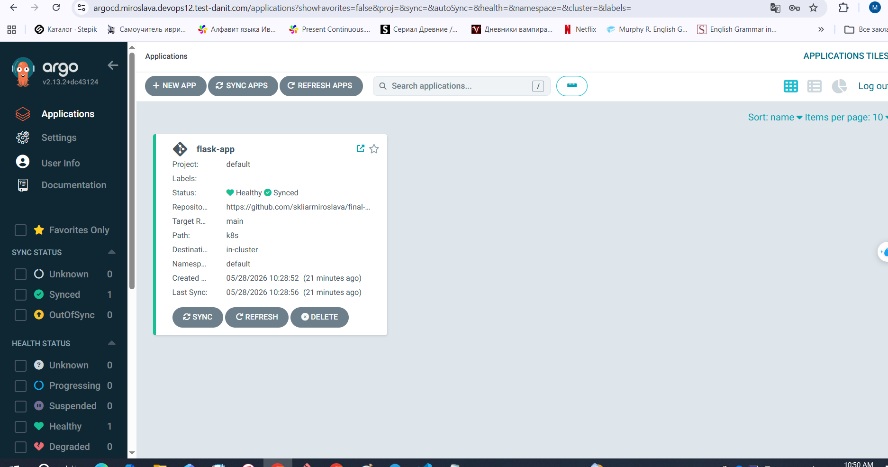
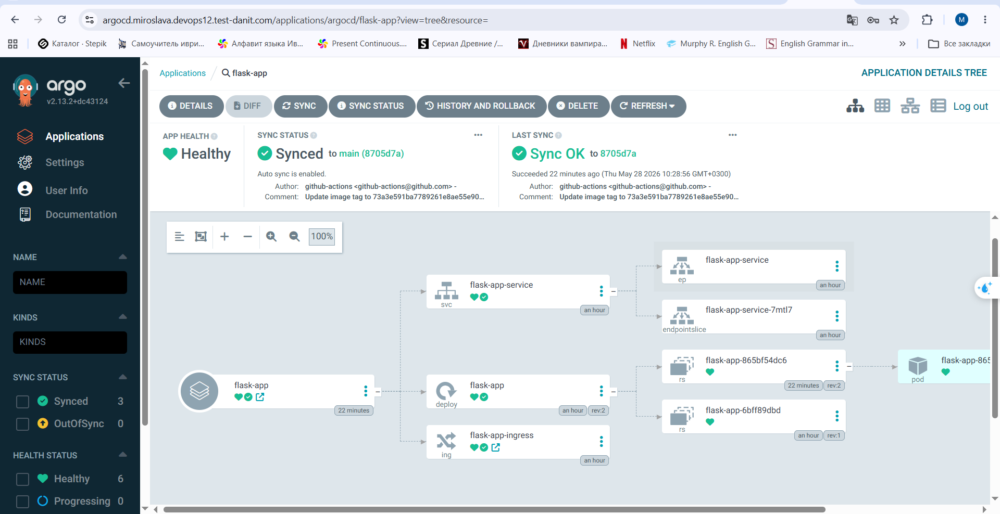
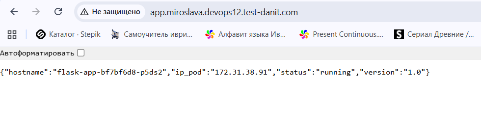
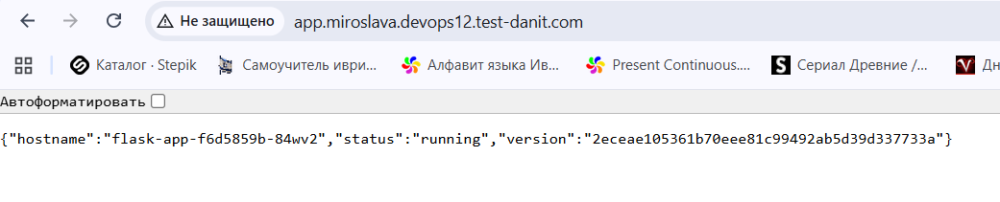

# Final DevOps Project

## Project Goal

The aim of this project is to build a complete DevOps CI/CD and GitOps workflow using AWS EKS, Terraform, Docker, GitHub Actions and ArgoCD.

The project includes:

* Python Flask API application
* Docker containerization
* GitHub Actions CI/CD pipeline
* Docker Hub image storage
* Terraform infrastructure provisioning
* AWS EKS Kubernetes cluster
* NGINX Ingress Controller
* ArgoCD GitOps deployment
* Automatic application updates after every new commit

---

# Architecture

Developer → GitHub → GitHub Actions → DockerHub → ArgoCD → AWS EKS Cluster

---

# Technologies

* Python / Flask
* Docker
* GitHub Actions
* Docker Hub
* Terraform
* AWS EKS
* Kubernetes
* ArgoCD
* NGINX Ingress Controller

---

# Infrastructure Deployment

## Terraform Apply

Terraform successfully provisioned AWS EKS infrastructure and deployed ArgoCD resources.

---

## Kubernetes Cluster Validation

kubectl commands verified nodes, services, ingress resources, and running pods inside the EKS cluster.

---

# GitOps Deployment

## ArgoCD Synchronization

ArgoCD synchronized Kubernetes manifests from the GitHub repository with the EKS cluster.

---

## ArgoCD Dashboard

ArgoCD dashboard displayed healthy and synchronized application state.

---

## ArgoCD Resource Tree

ArgoCD visualized Kubernetes deployment resources and relationships.

---

# CI/CD Pipeline

## GitHub Actions Pipeline

GitHub Actions pipeline automatically built and pushed Docker image to Docker Hub.

---

# Application Verification

## Application Endpoint

Application endpoint successfully returned deployed application version and pod information.

---

## Automatic Version Update

Application version was automatically updated after pushing new changes to GitHub repository.

---

# Additional Screenshots

Additional project screenshots are available in the `/screenshots` directory.
